<div align="center">
  
</div>


---


# 🖼️ **Shape and Color Detection with Computer Vision**

Welcome to the **Shape and Color Detection** repository! This project leverages computer vision techniques to detect shapes, analyze their properties, and work with color segmentation. The core functionality includes detecting various shapes, computing areas, traffic signal analysis, and segmenting images based on colors. 🚀

---

## 📂 **Repository Structure**

```plaintext
├── Detailed-Observations.docx   # Detailed documentation of the observations
├── README.md                    # Project documentation
├── Shape_Recognition_and_Color_Segmentation.ipynb  # Jupyter notebook for all tasks
├── images/                      # Contains all task output images
│   ├── Task1.1.png
│   ├── Task1.2.png
│   ├── Task1.3.png
│   ├── Task2.png
│   ├── Task3-1.png
│   ├── Task3-2.png
│   ├── Task3-3.png
│   ├── Task4-1.png
│   ├── Task4-2.png
│   ├── Task4-3.png
│   ├── Task4-4.png
│   ├── Task4-5.png
│   ├── Task4-6.png
│   ├── Task4-7.png
│   ├── Task4-8.png
│   ├── Task4-8.1.png
```

---

## 🛠️ **Features Implemented**

This project consists of several key tasks that cover various aspects of computer vision, such as shape detection, color segmentation, and traffic signal analysis.

- 🔍 **Detect Shape Coordinates**
- 📐 **Compute Shape Areas**
- 🚦 **Traffic Signal Detection**
- 🟢 **Shape and Color Detection** (8 Subtasks)

---

## 📖 **Tasks Overview**

### **📝 Task 1: Detect Shape Coordinates**

Detect and calculate the centroids of shapes in the image. The centroids are output as (x, y) coordinates.

📷 **Output:**

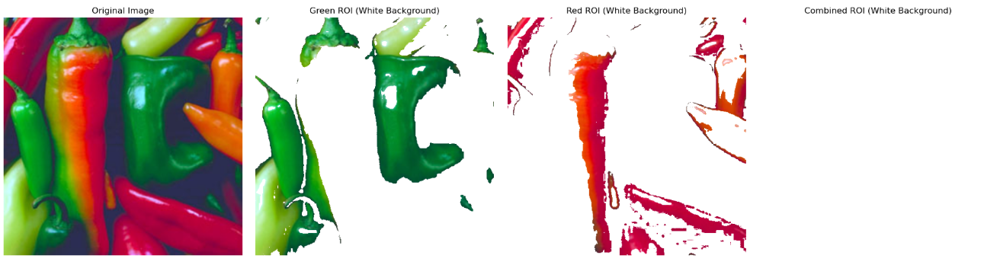

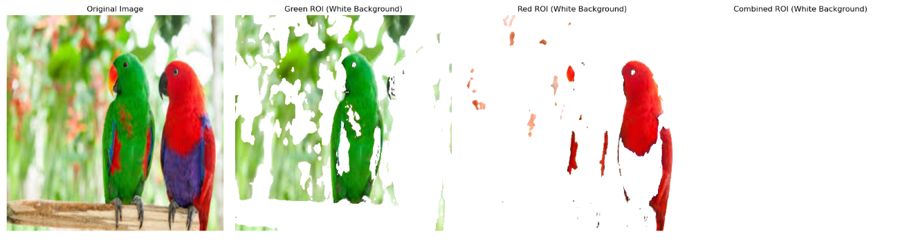

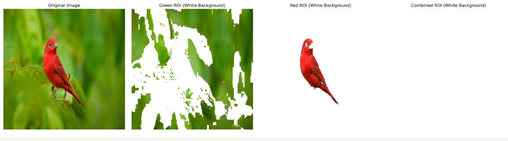

---

### **📝 Task 2: Compute Shape Areas**

Compute the area of each detected shape using contours.

📷 **Output:**

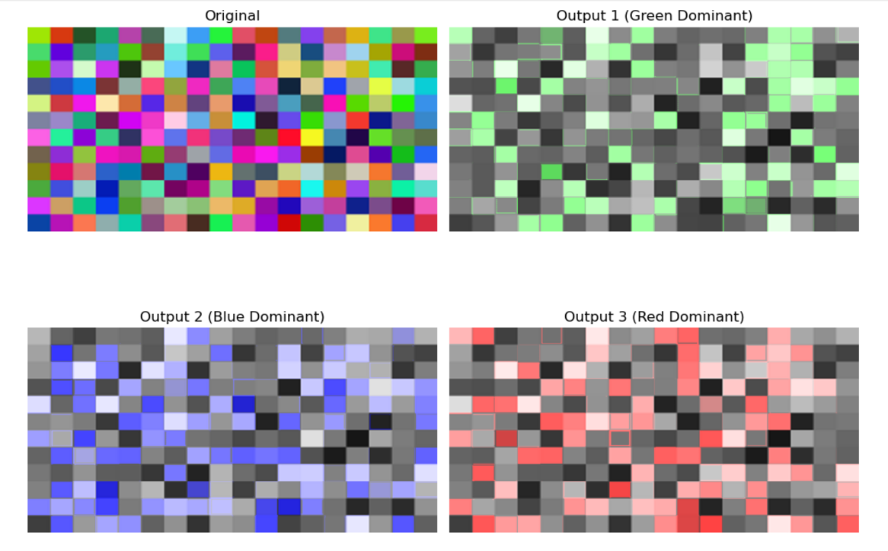

---

### **📝 Task 3: Traffic Signal Detection**

Analyze a traffic signal image and identify the active signal (red, yellow, or green).

📷 **Outputs:**

- **Red Signal Active:**

  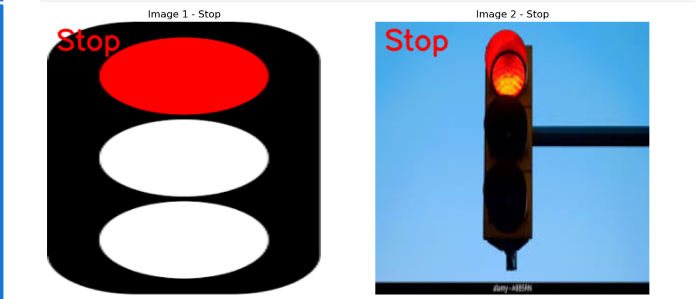

- **Yellow Signal Active:**

  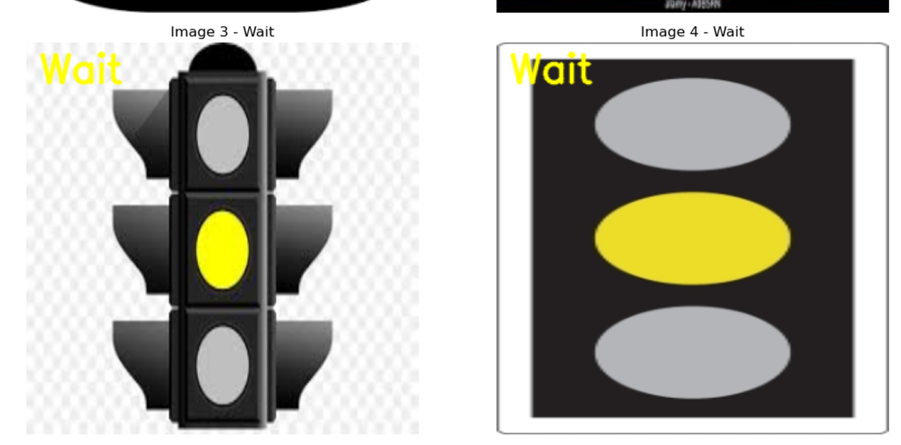

- **Green Signal Active:**

  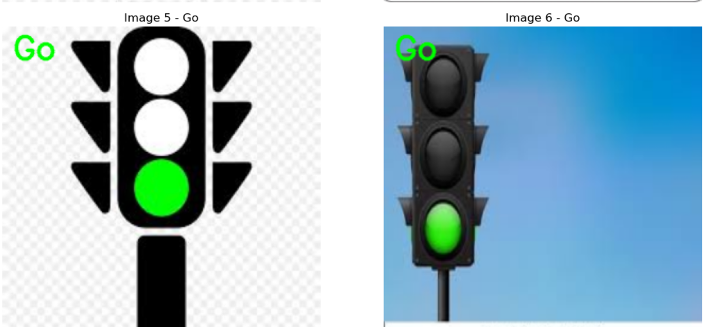

---

### **📝 Task 4: Shape and Color Detection**

Detect geometric properties of shapes, corners, and color-based regions. This task includes eight subtasks:

#### **Subprogram 1: Detect Shape Coordinates**
- **Technique:**
  - **Contour Detection:** Uses `cv2.findContours` to detect shapes in an image.
  - **Centroid Calculation:** The centroid (center) of each shape is computed using image moments (`cv2.moments`), providing the (x, y) coordinates.
  
📷 **Output:**
- **Detected Shape Coordinates:**

  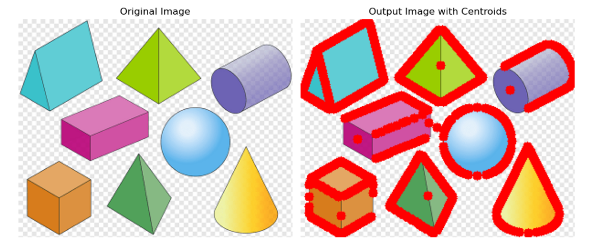

---

#### **Subprogram 2: Compute Area**
- **Technique:**
  - **Contour Area Calculation:** After detecting contours, the area of each shape is calculated using `cv2.contourArea` on the binary image, providing the area of each shape.

📷 **Output:**
- **Calculated Shape Areas:**

  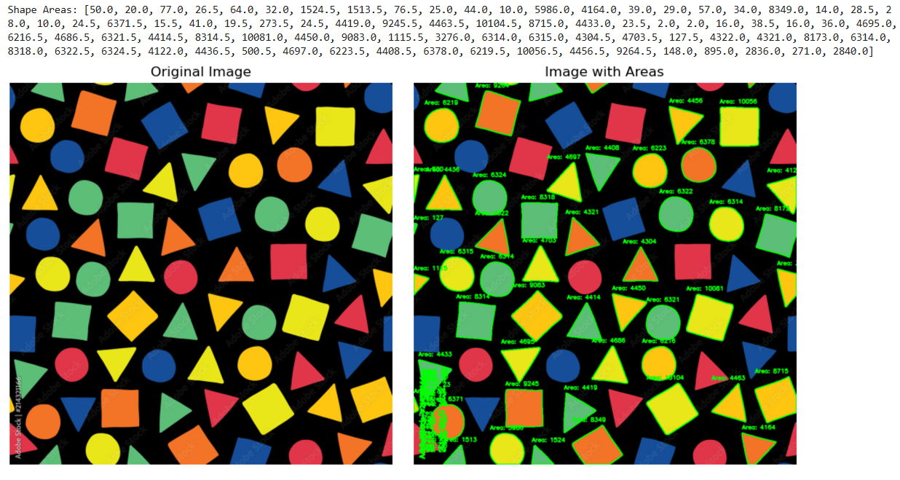

---

#### **Subprogram 3: Detect Red Circles**
- **Technique:**
  - **HSV Masking:** A mask is applied to isolate the red color in the image using the HSV color space.
  - **Circle Detection:** The Hough Circle Transform (`cv2.HoughCircles`) is then used to detect red circles based on radius and circularity criteria.

📷 **Output:**
- **Detected Red Circles:**

  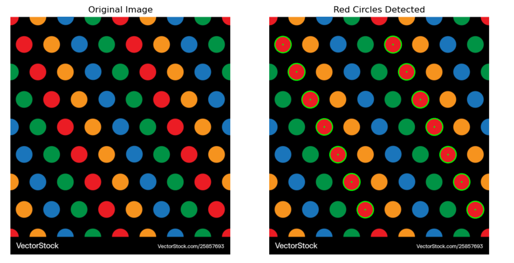

---

#### **Subprogram 4: Detect Green Shapes**
- **Technique:**
  - **HSV Masking:** A mask is created for the green color in the image using the HSV color space.
  - **Shape Highlighting:** The mask is applied to isolate and highlight all green shapes in the image.

📷 **Output:**
- **Detected Green Shapes:**

  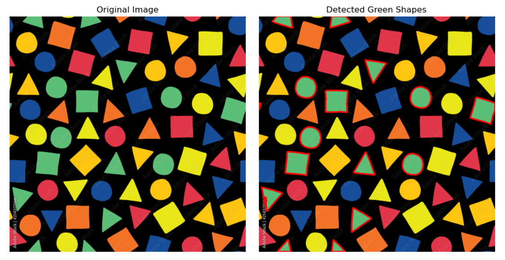

---

#### **Subprogram 5: Detect Large Circles**
- **Technique:**
  - **Modified Circle Detection:** Similar to Subprogram 3, but with larger radius thresholds in the Hough Circle Transform to specifically detect large circles.

📷 **Output:**
- **Detected Large Circles:**

  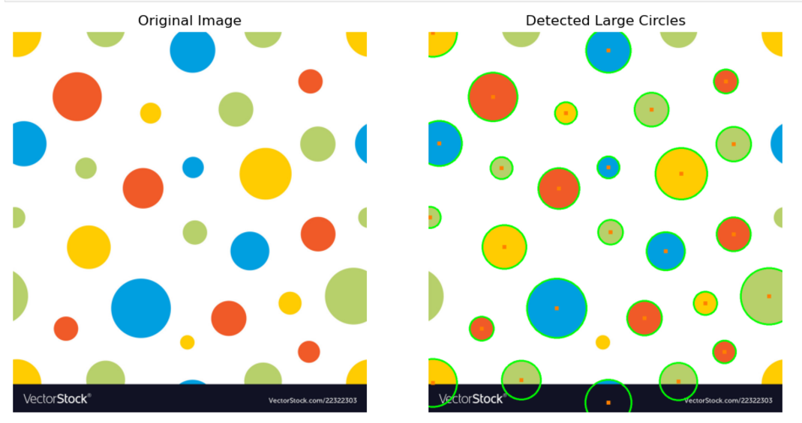

---

#### **Subprogram 6: Detect Small Circles**
- **Technique:**
  - **Modified Circle Detection:** The Hough Circle Transform is applied with smaller radius thresholds to detect small circles within the image.

📷 **Output:**
- **Detected Small Circles:**

  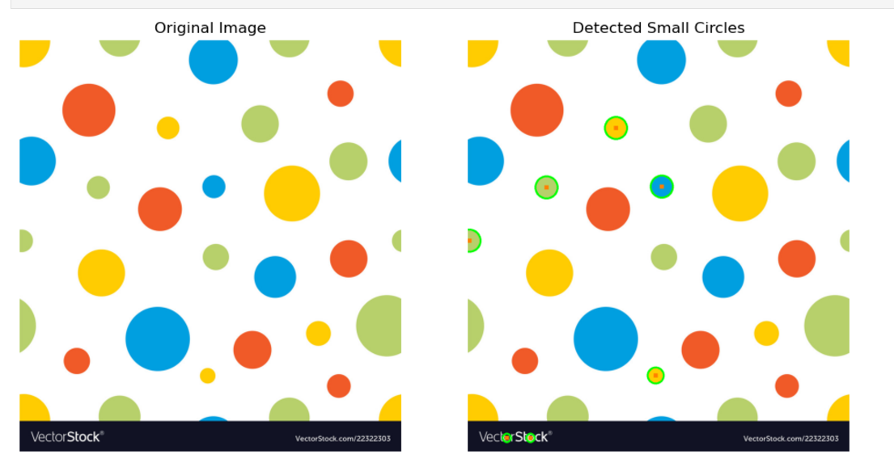

---

#### **Subprogram 7: Detect and Count Corners**
- **Technique:**
  - **Harris Corner Detection:** The function `cv2.goodFeaturesToTrack` detects corners in the shapes, identifying distinct points of intersection or sharp angles.

📷 **Output:**
- **Detected Corners:**

  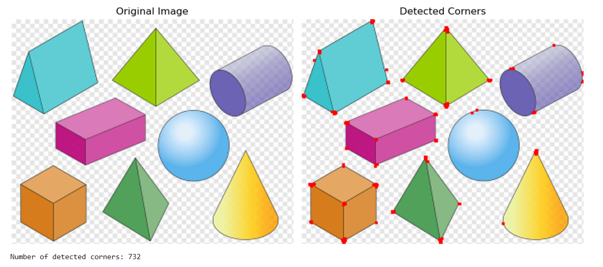

---

#### **Subprogram 8: Shape Segmentation and Display**
- **Technique:**
  - **Shape Segmentation:** Individual shapes are segmented from the image, isolated based on contours, and saved as separate image files for further analysis.
  - **Shape Display:** The segmented shapes are visualized and highlighted in the original image for better understanding.

📷 **Output:**
- **Segmented Shapes and Final Display:**

  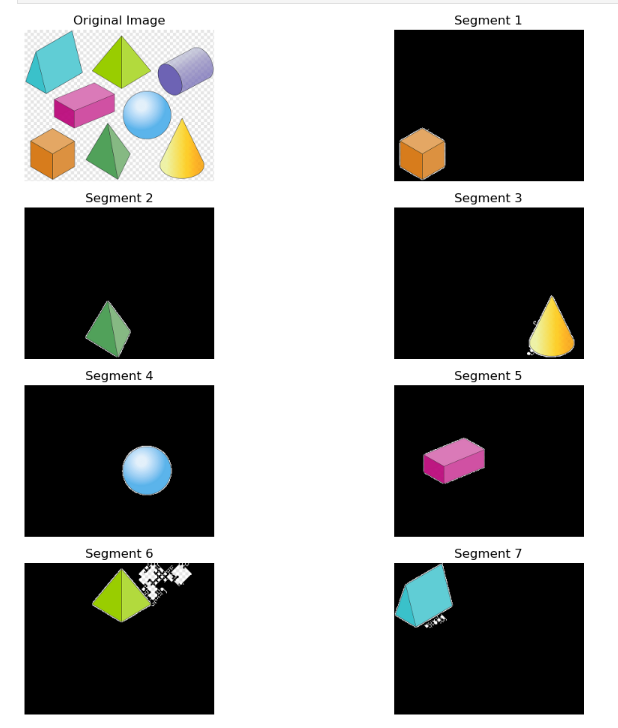

  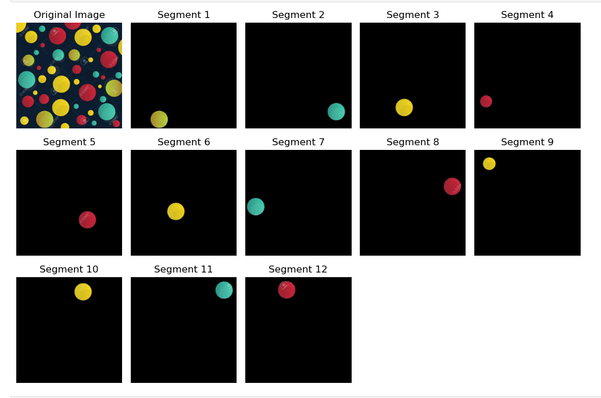

---

## 🧑‍💻 **Implementation Details**

Each task was implemented using OpenCV and Python for image processing. Below is a brief explanation of how each task was carried out:

### **Detect Shape Coordinates**
- **Method:** Shapes were identified using contour detection (`cv2.findContours`). The centroids were calculated using moments (`cv2.moments`) to determine the geometric center of each shape.

### **Compute Shape Areas**
- **Method:** The area of each shape was computed using the contour area function (`cv2.contourArea`) after detecting contours in the binary image.

### **Traffic Signal Detection**
- **Method:** The image was converted to HSV color space. Masks were created for red, yellow, and green hues. Pixel intensities in these masks determined which signal was active.

### **Shape and Color Detection**

#### **5.1 & 5.2: Detect Large and Small Circles**
- **Method:** Circle detection was implemented using the Hough Circle Transform (`cv2.HoughCircles`) with varying radius thresholds.

#### **5.3: Detect Corners**
- **Method:** Corners were detected using the Harris Corner Detection (`cv2.goodFeaturesToTrack`) to identify distinct corners in the shapes.

#### **5.4: Detect Red Circles**
- **Method:** The red color was isolated using HSV masks for two red hue ranges, and circles were filtered from the result using Hough Circle Transform.

#### **5.5: Detect Green Shapes**
- **Method:** The green color was detected using an HSV mask. All green areas were highlighted for visualization.

#### **5.6: Color Simplification**
- **Method:** Specific HSV masks for red, yellow, green, and blue were summed to retain only these colors, simplifying the image.

#### **5.7: Shape Segmentation**
- **Method:** Detected shapes were extracted as bounding rectangles from contours (`cv2.boundingRect`) and saved as individual image files.

#### **5.8: Highlight Segmented Shapes**
- **Method:** Each segmented shape was highlighted and visualized in a composite image for better understanding.

---

## 🚀 **How to Use**

1. **Clone the repository:**

```bash
git clone https://github.com/Bushra-Butt-17/Shape-Color-Detection-CV.git
```

2. **Install dependencies:**

```bash
pip install opencv-python numpy
```

3. **Open and run the `Shape_Recognition_and_Color_Segmentation.ipynb` notebook.**

4. **View the detailed observations in `Detailed-Observations.docx`.**

---

## 🛠️ **Technologies Used**

- **Python** 🐍
- **OpenCV** 🖼️
- **Numpy** 🔢

---


## 📜 **License**

This project is licensed under the MIT License - see the [LICENSE](LICENSE) file for details.

---

Feel free to modify and extend the project as you see fit. Happy coding! 👩‍💻👨‍💻

## 🙌 **Contributions**

Contributions are welcome! Feel free to open an issue or create a pull request to improve the project.

---
